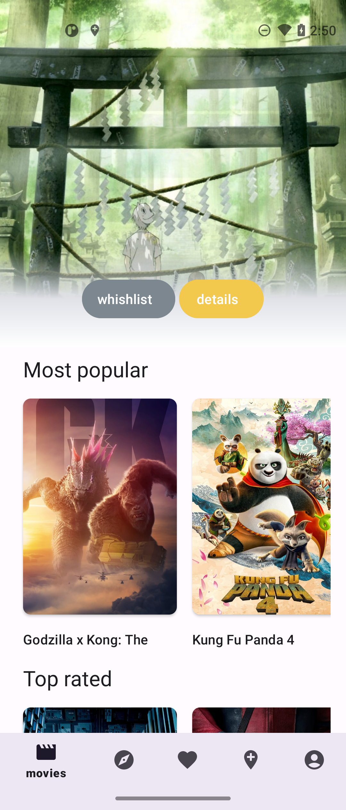
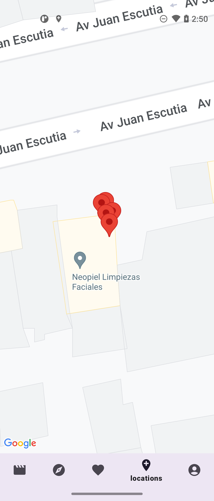
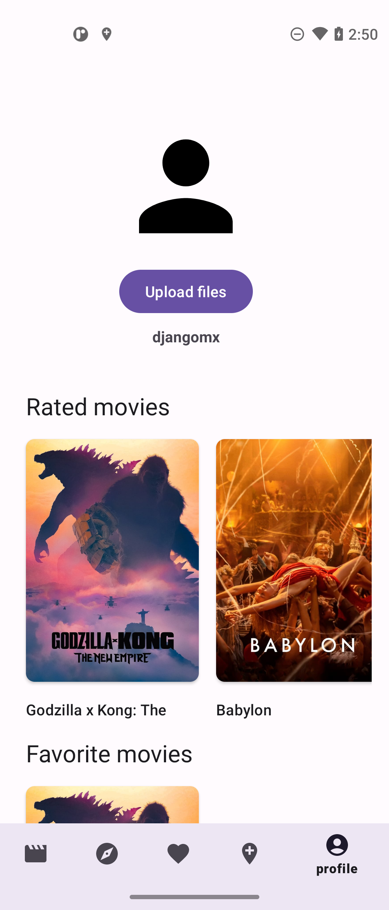
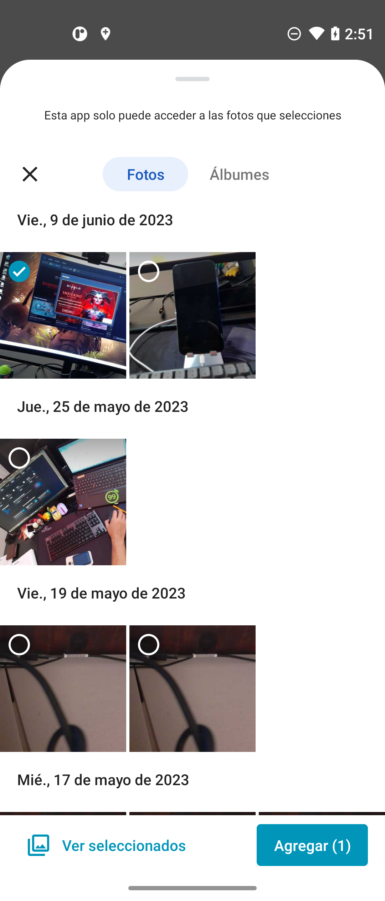

# MovieApp

MovieApp es una aplicación móvil Android diseñada para los aficionados al cine, permitiéndoles explorar un vasto catálogo de películas proporcionado por [The Movie Database (TMDB)](https://www.themoviedb.org/). Los usuarios pueden navegar a través de diferentes categorías como las más populares, las mejor calificadas y recomendaciones personalizadas.

## Características Principales

- **Listado de Películas:** Explora películas segmentadas en categorías de "Más Populares", "Mejor Calificadas" y "Recomendaciones".
- **Ubicación del usuario:** Utiliza Google Maps para mostrar la ubicación del usuario.
- **Subida de Archivos:** Permite a los usuarios subir imágenes o posters de películas a Firebase Storage.

## Arquitectura

La aplicación está construida utilizando el patrón **Model-View-ViewModel (MVVM)**, que facilita una separación clara entre la lógica de la interfaz de usuario y la lógica de negocio, mejorando así la mantenibilidad y la testabilidad del código.

### Tecnologías y Librerías

- **DataBinding:** Permite vincular componentes UI de los layouts a fuentes de datos de la app usando un formato declarativo.
- **Hilt:** Utilizado para la inyección de dependencias, simplificando así la gestión de dependencias en la aplicación.
- **Repository Pattern:** Abstrae la lógica de acceso a datos, permitiendo una mayor flexibilidad y escalabilidad.
- **Firebase Storage:** Para la subida y almacenamiento de archivos en la nube.
- **Google Maps API:** Integración de mapas para mostrar ubicaciones relevantes al usuario.

## Pantallas

## Screenshots
| Home | Maps | Profile | Picker |
|--|--|--|--|
|  |  |   | 

- **Pantalla Principal:** Muestra el listado de películas con un diseño segmentado por categorías.
- **Mapa de Cines:** Muestra un mapa con marcadores indicando la ubicación del usuario.
- **Subida de Imágenes:** Permite seleccionar y subir imágenes a Firebase Storage desde el dispositivo.

## Comenzando

Para ejecutar este proyecto localmente, clona el repositorio y asegúrate de tener Android Studio instalado. Necesitarás obtener una API key de TMDB y configurar un proyecto en Firebase para utilizar Firestore Storage y Google Maps.

```bash
git clone https://github.com/DjangoLC/OpenMovieChallenge
